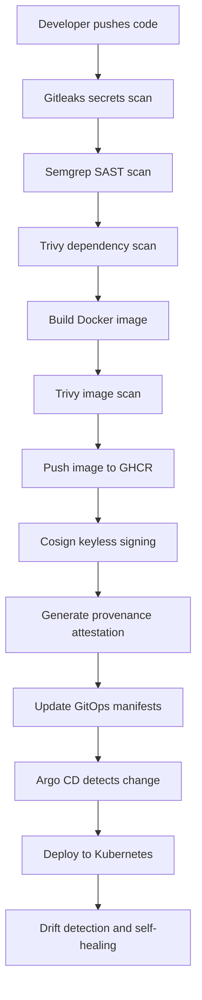

# Task 2 — Secure CI/CD Pipeline and Software Supply Chain

## Overview

This task implements a security-focused GitHub Actions pipeline for the Ledger API. The pipeline builds the container image, performs multiple security scans, publishes the image to GitHub Container Registry (GHCR), signs it using keyless Cosign, and generates supply-chain provenance.

Argo CD is used as the GitOps deployment controller. Kubernetes manifests stored in Git are treated as the desired state, enabling drift detection and automatic self-healing.

## Objectives

- Build the Ledger API container image
- Perform SAST using Semgrep
- Scan dependencies and container images using Trivy
- Detect committed secrets using Gitleaks
- Push approved images to GHCR
- Sign images using Cosign keyless signing
- Generate build provenance/attestation
- Upload supported scanner results as SARIF
- Deploy through Argo CD using GitOps
- Demonstrate drift detection and self-healing

## Repository Structure

```text
task-2/
├── app/
│   ├── app.py
│   └── requirements.txt
├── evidence/
## Secure CI/CD Pipeline Flow


│   ├── final-commit.txt
│   └── github-actions-workflow.txt
├── gitops/
│   ├── deployment.yaml
│   ├── ingress.yaml
│   ├── networkpolicy.yaml
│   ├── rbac.yaml
│   └── service.yaml
├── policies/
├── Dockerfile
└── README.md

.github/workflows/
└── build.yml
